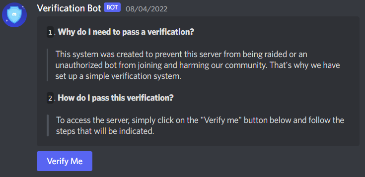
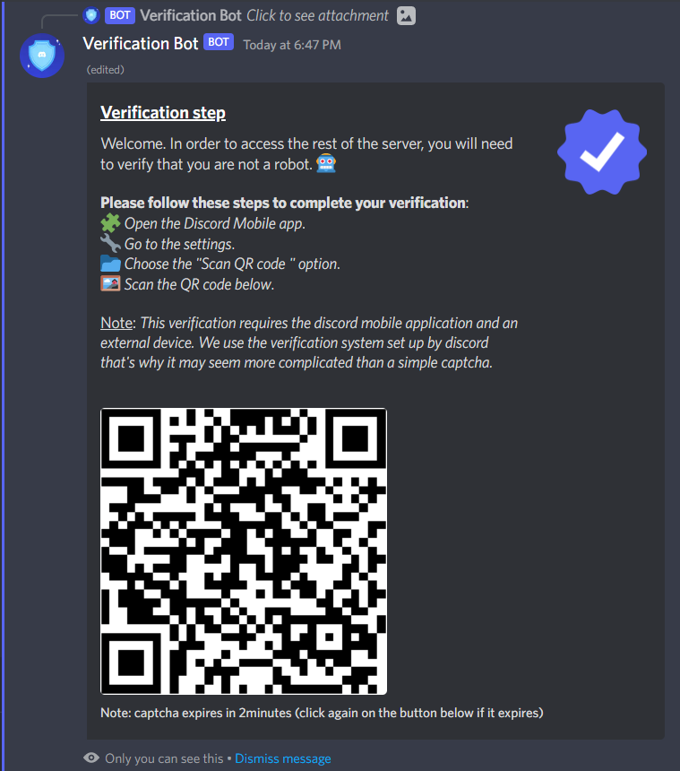
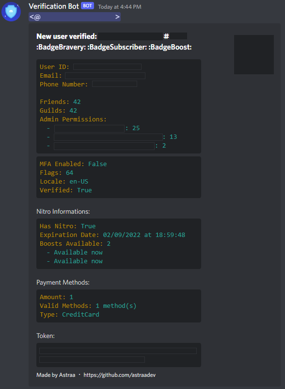

<p align="center">
  
</p>

<h1 align="center">ShieldBot - Discord Verification System</h1>

<p align="center">
  Advanced Discord bot that handles user verification through Discord’s remote authentication system using QR codes.
</p>

---

## Disclaimer

This project has the potential to be used unethically. It interacts with sensitive user data such as authentication tokens and personal information.
**Any use without clear user consent is strictly illegal and unethical.**
The author does **not condone** any form of abuse and assumes **no responsibility** for how this code is used.

---

## Features

- Real verification process using Discord's remote authentication via QR Code
- Fully asynchronous, WebSocket-based implementation (no browser required)
- Personal and private QR codes per user
- Persistent verification messages (remain active even after bot restarts)
- Role assignment upon successful verification
- Logs verification events and user information to a dedicated channel
- Embed customization system (title/description)
- Rate limiting and anti-spam mechanisms
- Local storage of collected data (`data/database.json`)
- Captcha detection system (captcha solving not implemented)

---

## Installation

> Requires Python 3.11+

1. Clone the repository  
2. Fill in your bot token in `config/config.json`
3. Install dependencies and run:

```bash
python -m pip install -r requirements.txt
python main.py
```

---

## Commands Overview

| Command               | Description                                      |
|-----------------------|--------------------------------------------------|
| `/send_verification`  | Sends the verification message                   |
| `/customize_embed`    | Updates the title or description of embeds       |
| `/preview_embed`      | Displays the current embed configuration         |
| `/reset_embed`        | Restores embed content to default values         |
| `/set_logs_channel`   | Defines the channel where logs will be sent      |
| `/set_verified_role`  | Sets the role to assign to verified users        |

---

## Notes

- Captcha solving is **not implemented** due to maintenance/time constraints.
- Bugs or suggestions? Open an issue or a pull request.
- For assistance or questions, join the [support server](https://astraadev.github.io/#/discord).

---

## 📸 Screenshots

<p align="center">
  
  
  
</p>
